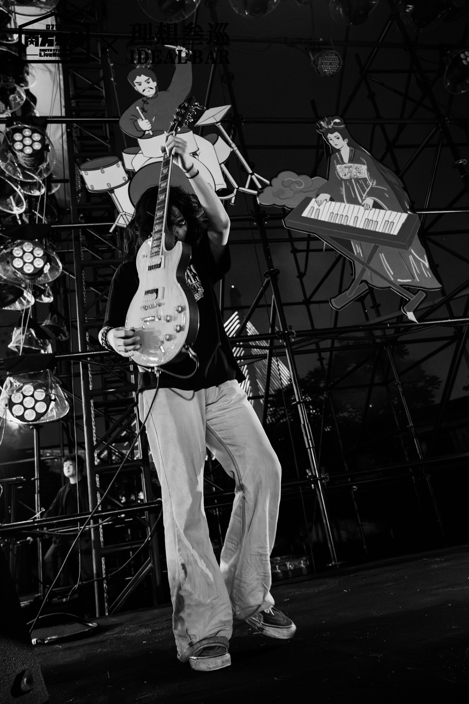
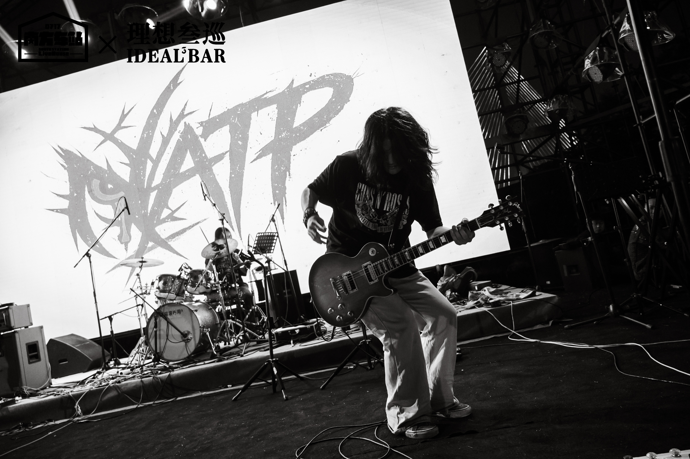
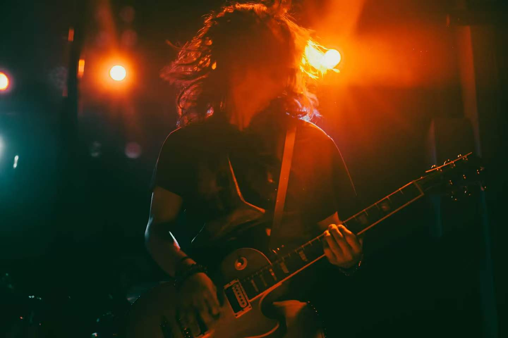
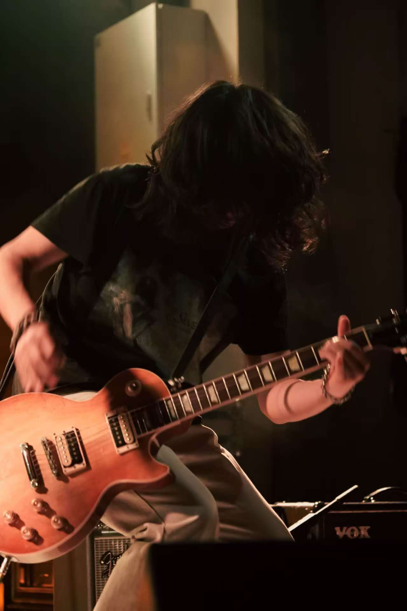
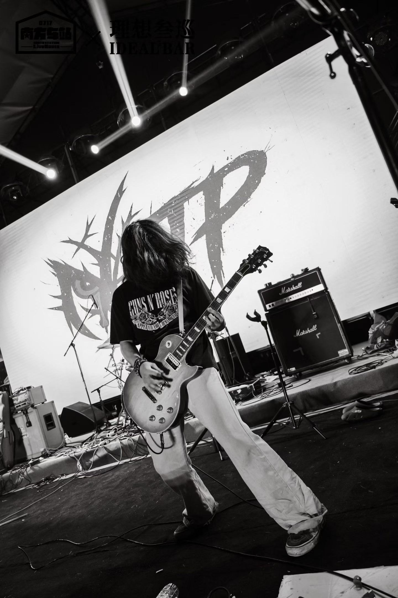

# Hi, I'm Ripped

### Lead guitarist of NATP · AI / Web3 / Creative Tools Explorer

**From NATP riffs to AI builds — turning sound, ideas, and code into something real.**

 

---

## About Me

- 🎸 Lead guitarist of NATP
- 🤖 Exploring AI tools and agent-based development
- 🌐 Interested in Web3, blockchain, and creative technology
- 🛠 Building small projects step by step
- 🎤 Trying to connect live music with technology

---

## Current Focus

- GitHub / VS Code / development workflow
- JavaScript / frontend basics
- AI coding tools
- Web3 basics
- Music-tech product ideas

---

## Tech & Tools

### Currently Learning

---

## Live Moments

  
  
  
   
  
  
  

---

## From Stage to Code

I started from live music and guitar, where every sound needs timing, energy, and feeling. Now I am learning to build with code, AI, and Web3 step by step. I want to turn creativity into real products: tools, experiences, and ideas that people can actually use.

---

## GitHub Stats

---

## Connect

- GitHub: [@Ripped-sys](https://github.com/Ripped-sys)
- Email: ystree111@qq.com
- Band: NAT Punch
- Douyin: NATP / 内网穿透
- Bilibili: NATP / 内网穿透
- NetEase Cloud Music: NATP / 内网穿透

---

## Mission

> “From NATP riffs to AI builds — turning sound, ideas, and code into something real.”

### Stage energy · Creative technology · Building in public

